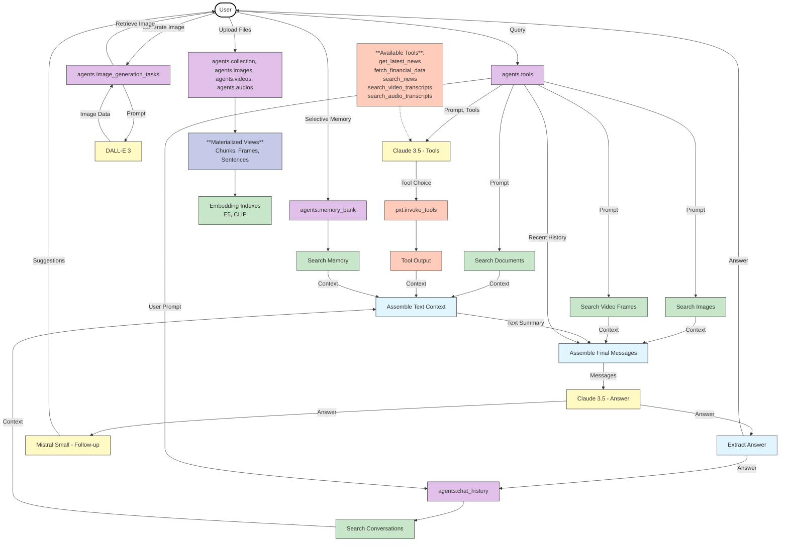

<div align="center">


[](https://opensource.org/licenses/Apache-2.0) [](https://discord.gg/QPyqFYx2UN)
<br>


</div>

[Pixelbot](http://agent.pixeltable.com/), a multimodal context-aware AI agent built using [Pixeltable](https://github.com/pixeltable/pixeltable) — open-source AI data infrastructure. The agent can process and reason about various data types (documents, images, videos, audio), use external tools, search its knowledge base derived from uploaded files, generate images, maintain a chat history, and leverage a selective memory bank.

The endpoint is built with Flask (Python) and the frontend with vanilla JS. This open source code replicates entirely what you can find at https://agent.pixeltable.com/ that is hosted on AWS EC2 instances.

## 🚀 How Pixeltable Powers This App

Pixeltable acts as AI Data Infrastructure, simplifying the development of this complex, infinite-memory multimodal agent:

-   📜 **Declarative Workflows**: The entire agent logic—from data ingestion and processing to LLM calls and tool execution—is defined declaratively using Pixeltable **tables**, **views**, and **computed columns** (`setup_pixeltable.py`). Pixeltable automatically manages dependencies and execution order.
-   🔀 **Unified Data Handling**: Natively handles diverse data types (documents, images, videos, audio) within its tables, eliminating the need for separate storage solutions.
-   ⚙️ **Automated Processing**: **Computed columns** automatically trigger functions (like thumbnail generation, audio extraction, transcription via Whisper, image generation via DALL-E) when new data arrives or dependencies change.
-   ✨ **Efficient Transformations**: **Views** and **Iterators** (like `DocumentSplitter`, `FrameIterator`, `AudioSplitter`) process data on-the-fly (e.g., chunking documents, extracting video frames) without duplicating the underlying data.
-   🔎 **Integrated Search**: **Embedding indexes** are easily added to tables/views, enabling powerful semantic search across text, images, and frames with simple syntax (`.similarity()`).
-   🔌 **Seamless Tool Integration**: Any Python function (`@pxt.udf`) or Pixeltable query function (`@pxt.query`) can be registered as a tool for the LLM using `pxt.tools()`. Pixeltable handles the invocation (`pxt.invoke_tools()`) based on the LLM's decision.
-   💾 **State Management**: Persistently stores all relevant application state (uploaded files, chat history, memory, generated images, workflow runs) within its managed tables.



## 📁 Project Structure

```
.
├── .env                  # Environment variables (API keys, AUTH_MODE)
├── .venv/                # Virtual environment files (if created here)
├── data/                 # Default directory for uploaded/source media files
├── logs/                 # Application logs
│   └── app.log
├── static/               # Static assets for Flask frontend (CSS, JS, Images)
│   ├── css/style.css
│   ├── image/*.png
│   ├── js/
│   │   ├── api.js
│   │   └── ui.js
│   └── manifest.json
│   └── robots.txt
│   └── sitemap.xml
├── templates/            # HTML templates for Flask frontend
│   └── index.html
├── endpoint.py           # Flask backend: API endpoints and UI rendering
├── functions.py          # Python UDFs and context assembly logic
├── config.py             # Central configuration (model IDs, defaults, personas)
├── requirements.txt      # Python dependencies
└── setup_pixeltable.py   # Pixeltable schema definition script
```

## 📊 Pixeltable Schema Overview

Pixeltable organizes data in directories, tables, and views. This application uses the following structure within the `agents` directory:

```
agents/
├── collection              # Table: Source documents (PDF, TXT, etc.)
│   ├── document: pxt.Document
│   ├── uuid: pxt.String
│   └── timestamp: pxt.Timestamp
├── images                  # Table: Source images
│   ├── image: pxt.Image
│   ├── uuid: pxt.String
│   ├── timestamp: pxt.Timestamp
│   └── thumbnail: pxt.String(computed) # Base64 sidebar thumbnail
├── videos                  # Table: Source videos
│   ├── video: pxt.Video
│   ├── uuid: pxt.String
│   ├── timestamp: pxt.Timestamp
│   └── audio: pxt.Audio(computed)      # Extracted audio (used by audio_chunks view)
├── audios                  # Table: Source audio files (MP3, WAV)
│   ├── audio: pxt.Audio
│   ├── uuid: pxt.String
│   └── timestamp: pxt.Timestamp
├── chat_history            # Table: Stores conversation turns
│   ├── role: pxt.String        # 'user' or 'assistant'
│   ├── content: pxt.String
│   └── timestamp: pxt.Timestamp
├── memory_bank             # Table: Saved text/code snippets
│   ├── content: pxt.String
│   ├── type: pxt.String         # 'code' or 'text'
│   ├── language: pxt.String    # e.g., 'python'
│   ├── context_query: pxt.String # Original query or note
│   └── timestamp: pxt.Timestamp
├── image_generation_tasks  # Table: Image generation requests & results
│   ├── prompt: pxt.String
│   ├── timestamp: pxt.Timestamp
│   └── generated_image: pxt.Image(computed) # DALL-E 3 output
├── user_personas           # Table: User-defined personas
│   ├── persona_name: pxt.String
│   ├── initial_prompt: pxt.String
│   ├── final_prompt: pxt.String
│   ├── llm_params: pxt.Json
│   └── timestamp: pxt.Timestamp
├── tools                   # Table: Main agent workflow orchestration
│   ├── prompt: pxt.String
│   ├── timestamp: pxt.Timestamp
│   ├── user_id: pxt.String
│   ├── initial_system_prompt: pxt.String
│   ├── final_system_prompt: pxt.String
│   ├── max_tokens, stop_sequences, temperature, top_k, top_p # LLM Params
│   ├── initial_response: pxt.Json(computed)  # Claude tool choice output
│   ├── tool_output: pxt.Json(computed)       # Output from executed tools (UDFs or Queries)
│   ├── doc_context: pxt.Json(computed)       # Results from document search
│   ├── image_context: pxt.Json(computed)     # Results from image search
│   ├── video_frame_context: pxt.Json(computed) # Results from video frame search
│   ├── memory_context: pxt.Json(computed)    # Results from memory bank search
│   ├── chat_memory_context: pxt.Json(computed) # Results from chat history search
│   ├── history_context: pxt.Json(computed)   # Recent chat turns
│   ├── multimodal_context_summary: pxt.String(computed) # Assembled text context for final LLM
│   ├── final_prompt_messages: pxt.Json(computed) # Fully assembled messages (incl. images/frames) for final LLM
│   ├── final_response: pxt.Json(computed)    # Claude final answer generation output
│   ├── answer: pxt.String(computed)          # Extracted text answer
│   ├── follow_up_input_message: pxt.String(computed) # Formatted prompt for Mistral
│   ├── follow_up_raw_response: pxt.Json(computed) # Raw Mistral response
│   └── follow_up_text: pxt.String(computed) # Extracted follow-up suggestions
├── chunks                  # View: Document chunks via DocumentSplitter
│   └── (Implicit: EmbeddingIndex: E5-large-instruct on text)
├── video_frames            # View: Video frames via FrameIterator (1 FPS)
│   └── (Implicit: EmbeddingIndex: CLIP on frame)
├── video_audio_chunks      # View: Audio chunks from video table via AudioSplitter
│   └── transcription: pxt.Json(computed)   # Whisper transcription
├── video_transcript_sentences # View: Sentences from video transcripts via StringSplitter
│   └── (Implicit: EmbeddingIndex: E5-large-instruct on text)
├── audio_chunks            # View: Audio chunks from audio table via AudioSplitter
│   └── transcription: pxt.Json(computed)   # Whisper transcription
└── audio_transcript_sentences # View: Sentences from direct audio transcripts via StringSplitter
    └── (Implicit: EmbeddingIndex: E5-large-instruct on text)

# Available Tools (Registered via pxt.tools()):
# - functions.get_latest_news (UDF)
# - functions.fetch_financial_data (UDF)
# - functions.search_news (UDF)
# - search_video_transcripts (@pxt.query function)
# - search_audio_transcripts (@pxt.query function)

# Embedding Indexes Enabled On:
# - agents.chunks.text
# - agents.images.image
# - agents.video_frames.frame
# - agents.video_transcript_sentences.text
# - agents.audio_transcript_sentences.text
# - agents.memory_bank.content
# - agents.chat_history.content
```

## ▶️ Getting Started

### Prerequisites

You are welcome to swap any of the below calls, e.g. [WhisperX](https://docs.pixeltable.com/docs/examples/search/audio) instead of OpenAI Whisper, [Llama.cpp](https://docs.pixeltable.com/docs/integrations/frameworks#local-llm-runtimes) instead of Mistral... either through our built-in modules or by bringing your own models, frameworks, and API calls. See our [integration](https://docs.pixeltable.com/docs/integrations/frameworks) and [UDFs](https://docs.pixeltable.com/docs/datastore/custom-functions) pages to learn more. You can easily make this applicaiton entirely local if you decide to rely on local LLM runtimes and local embedding/transcription solutions.

-   Python 3.9+
-   API Keys:
    -   [Anthropic](https://console.anthropic.com/)
    -   [OpenAI](https://platform.openai.com/api-keys)
    -   [Mistral AI](https://console.mistral.ai/api-keys/)
    -   [NewsAPI](https://newsapi.org/) (100 requests per day free)

### Installation

```bash
# 1. Create and activate a virtual environment (recommended)
python -m venv .venv
# Windows: .venv\Scripts\activate
# macOS/Linux: source .venv/bin/activate

# 2. Install dependencies
pip install -r requirements.txt
```

### Environment Setup

Create a `.env` file in the project root and add your API keys. Keys marked with `*` are required for core LLM functionality.

```dotenv
# Required for Core LLM Functionality *
ANTHROPIC_API_KEY=sk-ant-api03-...  # For main reasoning/tool use (Claude 3.5 Sonnet)
OPENAI_API_KEY=sk-...             # For audio transcription (Whisper) & image generation (DALL-E 3)
MISTRAL_API_KEY=...               # For follow-up question suggestions (Mistral Small)

# Optional (Enable specific tools by providing keys)
NEWS_API_KEY=...                  # Enables the NewsAPI tool
# Note: yfinance and DuckDuckGo Search tools do not require API keys.

# --- !!**Authentication Mode (required to run locally)**!! ---
# Set to 'local' to bypass the WorkOS authentication used at agent.pixeltable.com and to leverage a default user.
# Leaving unset will result in errors
AUTH_MODE=local
```

### Running the Application

1.  **Initialize Pixeltable Schema:**
    This script creates the necessary Pixeltable directories, tables, views, and computed columns defined in `setup_pixeltable.py`. Run this *once* initially.

    *Why run this?* This defines the data structures and the declarative AI workflow within Pixeltable. It tells Pixeltable how to store, transform, index, and process your data automatically.

    ```bash
    python setup_pixeltable.py
    ```

2.  **Start the Web Server:**
    This runs the Flask application using the Waitress production server by default.

    ```bash
    python endpoint.py
    ```

    The application will be available at `http://localhost:5000`.

**Data Persistence Note:** Pixeltable stores all its data (file references, tables, views, indexes) locally, typically in a `.pixeltable` directory created within your project workspace. This means your uploaded files, generated images, chat history, and memory bank are persistent across application restarts.

## 🖱️ Usage Overview

The web interface provides several tabs:

-   **Chat Interface**: Main interaction area. Ask questions, switch between chat and image generation modes. View results, including context retrieved (images, video frames) and follow-up suggestions. Save responses to the Memory Bank.
-   **Agent Settings**: Configure the system prompts (initial for tool use, final for answer generation) and LLM parameters (temperature, max tokens, etc.) used by Claude.
-   **Chat History**: View past queries and responses. Search history and view detailed execution metadata for each query. Download history as JSON.
-   **Generated Images**: View images created using the image generation mode. Search by prompt, view details, download, or delete images.
-   **Memory Bank**: View, search, manually add, and delete saved text/code snippets. Download memory as JSON.
-   **How it Works**: Provides a technical overview of how Pixeltable powers the application's features.

## ⭐ Key Features

-   💾 **Unified Multimodal Data Management**: Ingests, manages, process, and index documents (text, PDFs, markdown), images (JPG, PNG), videos (MP4), and audio files (MP3, WAV) using Pixeltable's specialized [data types](https://docs.pixeltable.com/docs/datastore/bringing-data).
-   ⚙️ **Declarative AI Workloads**: Leverages Pixeltable's **[computed columns](https://docs.pixeltable.com/docs/datastore/computed-columns)** and **[views](https://docs.pixeltable.com/docs/datastore/views)** to declaratively define complex conditional workflows including data processing (chunking, frame extraction, audio extraction), embedding generation, AI model inference, and context assembly while maintaining data lineage and versioning.
-   🧠 **Agentic RAG & Tool Use**: The agent dynamically decides which tools to use based on the query. Available tools include:
    -   **External APIs**: Fetching news (NewsAPI, DuckDuckGo), financial data (yfinance).
    -   **Internal Knowledge Search**: Pixeltable `@pxt.query` functions are registered as tools, allowing the agent to search video transcripts and audio transcripts on demand, as an example.
-   🔍 **Semantic Search**: Implements [vector search](https://docs.pixeltable.com/docs/datastore/vector-database) across multiple modalities, powered by any **embedding indexes** that Pixeltable incrementally and automatically maintain:
    -   Document Chunks (`sentence-transformers`)
    -   Images & Video Frames (`CLIP`)
    -   Chat History (`sentence-transformers`)
    -   Memory Bank items (`sentence-transformers`)
-   🔌 **LLM Integration**: Seamlessly [integrates](https://docs.pixeltable.com/docs/integrations/frameworks) multiple LLMs for different tasks within the Pixeltable workflow:
    -   **Reasoning & Tool Use**: Anthropic Claude 3.5 Sonnet
    -   **Audio Transcription**: OpenAI Whisper (via computed columns on audio chunks)
    -   **Image Generation**: OpenAI DALL-E 3 (via computed columns on image prompts)
    -   **Follow-up Suggestions**: Mistral Small Latest
-   💬 **Chat History**: Persistently stores conversation turns in a Pixeltable [table](https://docs.pixeltable.com/docs/datastore/tables-and-operations) (`agents.chat_history`), enabling retrieval and semantic search over past interactions.
-   📝 **Memory Bank**: Allows saving and semantically searching important text snippets or code blocks stored in a dedicated Pixeltable table (`agents.memory_bank`).
-   🖼️ **Image Generation**: Generates images based on user prompts using DALL-E 3, orchestrated via a Pixeltable table (`agents.image_generation_tasks`).
-   🏠 **Local Mode**: Supports running locally without external authentication ([WorkOS](https://github.com/workos/python-flask-example-applications)) (`AUTH_MODE=local`) for easier setup and development.
-   🖥️ **Responsive UI**: A clean web interface built with Flask, Tailwind CSS, and JavaScript.
-   🛠️ **Centralized Configuration**: Uses an arbitraty `config.py` to manage model IDs, default system prompts, LLM parameters, and persona presets.

## ⚠️ Disclaimer

This application serves as a comprehensive demonstration of Pixeltable's capabilities for managing complex multimodal AI workflows, covering data storage, transformation, indexing, retrieval, and serving.

The primary focus is on illustrating Pixeltable patterns and best practices within the `setup_pixeltable.py` script and related User-Defined Functions (`functions.py`).

While functional, less emphasis was placed on optimizing the Flask application (`endpoint.py`) and the associated frontend components (`style.css`, `index.html`, `ui.js`...). These parts should not necessarily be considered exemplars of web development best practices.

For simpler examples demonstrating Pixeltable integration with various frameworks (FastAPI, React, TypeScript, Gradio, etc.), please refer to the [Pixeltable Examples Documentation](https://docs.pixeltable.com/docs/examples/use-cases).
